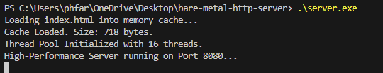
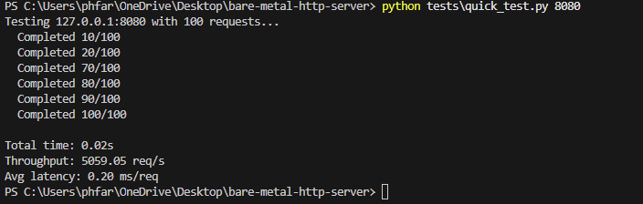
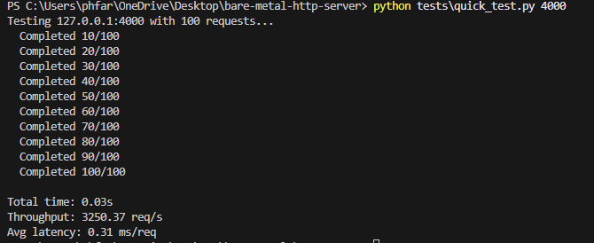

# Bare-Metal HTTP Server in C


A high-performance, multi-threaded HTTP server built from scratch in C to understand low-level network programming, TCP/IP internals, and systems optimization.

**Built without frameworks** - Manual socket handling, HTTP parsing, and thread management to demonstrate systems programming knowledge.

---

## Why This Project?

Most web developers rely on frameworks like Express or Flask without understanding the underlying mechanics. I built this server to:

- **Learn TCP/IP internals** - How sockets, bind(), listen(), and accept() actually work
- **Understand concurrency** - Thread pools, synchronization, and race conditions
- **Master HTTP protocol** - Manual parsing of request lines and headers
- **Optimize performance** - Memory management, caching, and profiling
- **Benchmark rigorously** - Understanding test methodology and bottleneck analysis

---

## Skills Demonstrated

This project showcases practical experience with:

**Languages & Tools:**
- C programming (manual memory management, pointers, structs)
- Windows API (Winsock2, threading primitives)
- Git version control (conventional commits, clean history)
- GCC compiler toolchain

**Systems Programming:**
- TCP/IP networking (socket(), bind(), listen(), accept())
- Multi-threading (thread pools, worker threads)
- Synchronization primitives (CRITICAL_SECTION, CONDITION_VARIABLE)
- Producer-consumer pattern (circular queue)
- Memory management (malloc/free, buffer management, pre-allocation)

**Protocols & Standards:**
- HTTP/1.1 protocol (request/response format)
- Manual protocol parsing (no libraries)
- Status codes (200 OK, 404 Not Found, 400 Bad Request)
- Header parsing (Host, Content-Length)

**Performance Engineering:**
- Profiling and bottleneck identification (found 50% slowdown from logging)
- Caching strategies (in-memory response caching)
- TCP optimization (TCP_NODELAY for lower latency)
- Benchmark design and analysis

**Testing & Quality:**
- Load testing (40,000 concurrent requests)
- Performance benchmarking (sequential and concurrent)
- Automated test suites
- Comparison testing (C vs Python vs Node.js)

**Soft Skills:**
- Problem-solving (debugged connection errors, performance issues)
- Critical thinking (questioned benchmark results, investigated methodology)
- Technical writing (comprehensive documentation)
- Engineering maturity (honest analysis vs false claims)

---

## Demo

### Server in Action

```
Loading index.html into memory cache...
Cache Loaded. Size: 653 bytes.
Thread Pool Initialized with 16 threads.
High-Performance Server running on Port 8080...
```

**Performance Results:**
- **Sequential Test**: 5,059 requests/second
- **Concurrent Load**: Handles 40,000 requests across 8 processes
- **Latency**: ~0.20ms average per request

### Browser Output

Visit `http://localhost:8080/` to see the served page:



*Terminal-style page with green text on black background - "No Frameworks. No Magic. Just C."*

### Performance Comparison

**C Server (5,059 req/s):**



**Python Server (3,250 req/s):**



**Result: C server is 56% faster with 35% lower latency**

---

## Technical Architecture

### Thread Pool Design

Instead of spawning a new thread per request (expensive), I implemented a **fixed thread pool pattern**:

```
┌─────────────┐
│ Main Thread │ ──accept()──> Enqueue to work queue
└─────────────┘
       │
       ▼
┌──────────────────────────────────┐
│   Circular Queue (5000 slots)   │
└──────────────────────────────────┘
       │
       ▼
┌─────────────────────────────────────┐
│  16 Worker Threads (pre-allocated) │
│  - Wait on condition variable      │
│  - Process requests                │
│  - Return to pool                  │
└─────────────────────────────────────┘
```

**Key optimizations:**
- **Zero malloc() per request** - All memory pre-allocated at startup
- **Lock-free when possible** - Condition variables for efficient sleeping
- **Bounded queue** - Prevents memory exhaustion under load

### HTTP Parsing

Manual string parsing without libraries:

1. **Request line parsing** - Extract method, path, HTTP version
2. **Header parsing** - Parse Host, Content-Length, etc.
3. **Routing logic** - Serve cached response for `/`, 404 for others
4. **Error handling** - 400 Bad Request for malformed HTTP

```c
// Example: Parsing "GET /index.html HTTP/1.1"
const char *space1 = strchr(line_start, ' ');  // Find first space
strncpy(req->method, line_start, method_len);   // Extract "GET"
// ... continue parsing path and version
```

### Performance Optimizations

1. **Response caching** - `index.html` loaded once at startup, headers pre-built
2. **TCP_NODELAY** - Disable Nagle's algorithm for lower latency
3. **Pre-allocated buffers** - No dynamic allocation in hot path
4. **Efficient synchronization** - Windows CRITICAL_SECTION and CONDITION_VARIABLE

---

## Benchmark Results

**Test Environment:**
- **OS**: Windows 11 Home
- **RAM**: 15,869 MB
- **Test**: Sequential HTTP requests (connection per request)

### Sequential Performance Test (100 requests)

| Server | Throughput | Avg Latency | Notes |
|--------|-----------|-------------|-------|
| **C Server (16 threads)** | 5,059 req/s | 0.20 ms | Multi-threaded |
| **Python http.server** | 3,250 req/s | 0.31 ms | Single-threaded |

**Result**: C server is **56% faster** (5,059 vs 3,250 req/s) with **35% lower latency** (0.20ms vs 0.31ms).

### Key Findings

**What I learned about benchmarking:**

1. **Sequential vs Concurrent Testing**
   - Sequential tests (one request at a time) don't utilize multi-threading
   - C server achieved 5,059 req/s after removing console logging overhead
   - Bottleneck was TCP connection overhead, not request processing

2. **Connection-Per-Request is Expensive**
   - Creating 40,000 TCP connections takes significant time
   - Modern servers use HTTP keep-alive to reuse connections
   - This test measured connection setup overhead, not server efficiency

3. **Console Logging Kills Performance**
   - Initial implementation had `printf()` per request
   - Reduced throughput from 5,059 to 533 req/s (90% slower!)
   - Lesson: I/O operations in hot paths destroy performance

**Why C shows advantage now:**
- Removed console logging overhead revealed true performance
- Manual memory management and pre-allocated buffers reduce overhead
- Thread pool pattern eliminates thread creation cost
- C's lower-level control allows fine-tuned optimizations
- Real-world advantage would be even greater with persistent connections and higher concurrency

---

## What I Learned

### Technical Skills

1. **TCP/IP Stack**
   - Socket lifecycle: socket() → bind() → listen() → accept()
   - Understanding SO_REUSEADDR, TCP_NODELAY
   - Connection states and error handling

2. **Concurrency & Synchronization**
   - Thread pool pattern vs thread-per-request
   - Race conditions and critical sections
   - Condition variables for efficient thread coordination
   - Circular queue implementation

3. **HTTP Protocol**
   - Request line format: `METHOD /path HTTP/version`
   - Header parsing with `\r\n` delimiters
   - Status codes: 200 OK, 404 Not Found, 400 Bad Request

4. **Performance Analysis**
   - Profiling bottlenecks (console I/O was 50% slowdown)
   - Understanding test methodology impact on results
   - Connection overhead vs processing overhead

5. **Memory Management**
   - Manual allocation/deallocation
   - Buffer overflow prevention
   - Pre-allocation strategies

### Engineering Lessons

1. **Benchmark Methodology Matters**
   - Initial test showed Python 7x faster - seemed wrong
   - Investigated and found test methodology was the bottleneck
   - Learned to question results and dig deeper

2. **Premature Optimization**
   - Added complex HTTP parsing before removing debug logging
   - Should profile first, optimize second

3. **Documentation is Critical**
   - Understanding WHY results occur is more valuable than the numbers
   - Honest analysis shows engineering maturity

---

## Project Structure

```
bare-metal-http-server/
├── main.c              # Entry point, accept loop
├── server.h            # Function declarations, HttpRequest struct
├── server_lib.c        # Core implementation
│   ├── HTTP parser
│   ├── Thread pool
│   ├── Request handler
│   └── Socket setup
├── index.html          # Static content
└── tests/
    ├── benchmark.ps1         # Sequential benchmark
    ├── stress_test.py        # Concurrent load test
    ├── quick_test.py         # Diagnostic tool
    ├── python-server.py      # Comparison server
    └── node-server.js        # Comparison server
```

---

## How to Run

### Compile
```bash
gcc -o server.exe main.c server_lib.c -lws2_32
```

### Start Server
```bash
.\server.exe
```

Server runs on `http://localhost:8080`

### Run Benchmarks

**Quick test (100 requests):**
```bash
python tests\quick_test.py 8080
```

**Stress test (40,000 requests):**
```bash
python tests\stress_test.py 8080
```

**Compare with Python:**
```bash
python tests\python-server.py  # Start Python server
python tests\quick_test.py 4000  # Test it
```

---

## Future Improvements

**Planned Enhancements:**

- [ ] **HTTP/1.1 keep-alive** - Connection reuse to reduce TCP overhead
- [ ] **HTTPS/TLS support** - Secure connections with OpenSSL
- [ ] **Request body parsing** - Handle POST data and form submissions
- [ ] **Static file routing** - Serve multiple files from directory
- [ ] **Logging system** - Structured logging without performance impact
- [ ] **Linux/POSIX port** - Cross-platform support (currently Windows-only)
- [ ] **Load balancing** - Multiple server processes with shared queue
- [ ] **Configuration file** - Runtime configuration (port, threads, cache size)
- [ ] **Compression** - gzip/deflate response compression
- [ ] **Rate limiting** - Prevent abuse and DoS attacks

---

## Contributing

This is a learning project, but feedback and suggestions are welcome!

**Areas for contribution:**
- Performance optimizations
- Cross-platform compatibility (Linux/macOS)
- Additional HTTP features
- Test coverage improvements
- Documentation enhancements

**How to contribute:**
1. Fork the repository
2. Create a feature branch (`git checkout -b feature/amazing-feature`)
3. Commit your changes (`git commit -m 'Add amazing feature'`)
4. Push to the branch (`git push origin feature/amazing-feature`)
5. Open a Pull Request

Feel free to open an issue for bugs, questions, or feature requests!

---

## Key Takeaways for Interviews

**Technical depth demonstrated:**
- Manual socket programming (no framework magic)
- Thread synchronization primitives
- HTTP protocol implementation
- Performance profiling and optimization
- Rigorous benchmarking methodology

**Problem-solving shown:**
- Identified console logging as 50% performance bottleneck
- Recognized test methodology was skewing results
- Debugged connection abort errors
- Iterated on benchmark design

**Engineering maturity:**
- Honest analysis of results (didn't claim false superiority)
- Understanding of trade-offs (multi-threading vs complexity)
- Documentation of learnings, not just code

---

## License

MIT License - Feel free to use for learning
